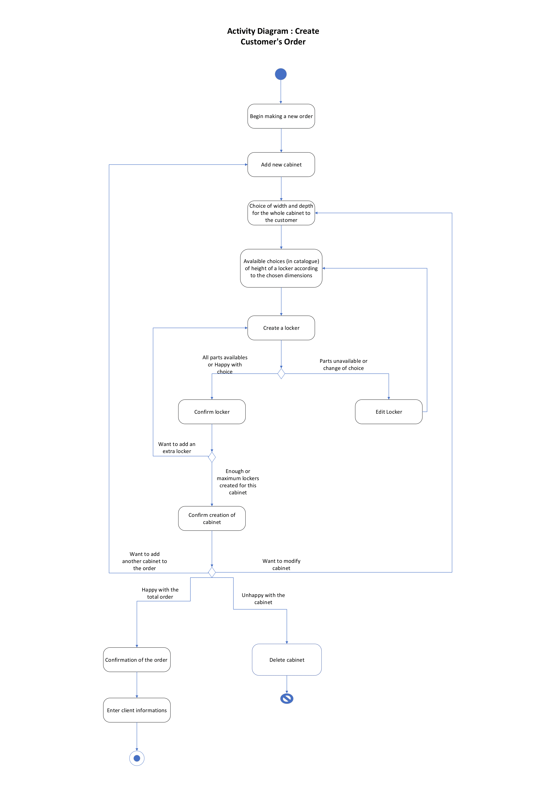
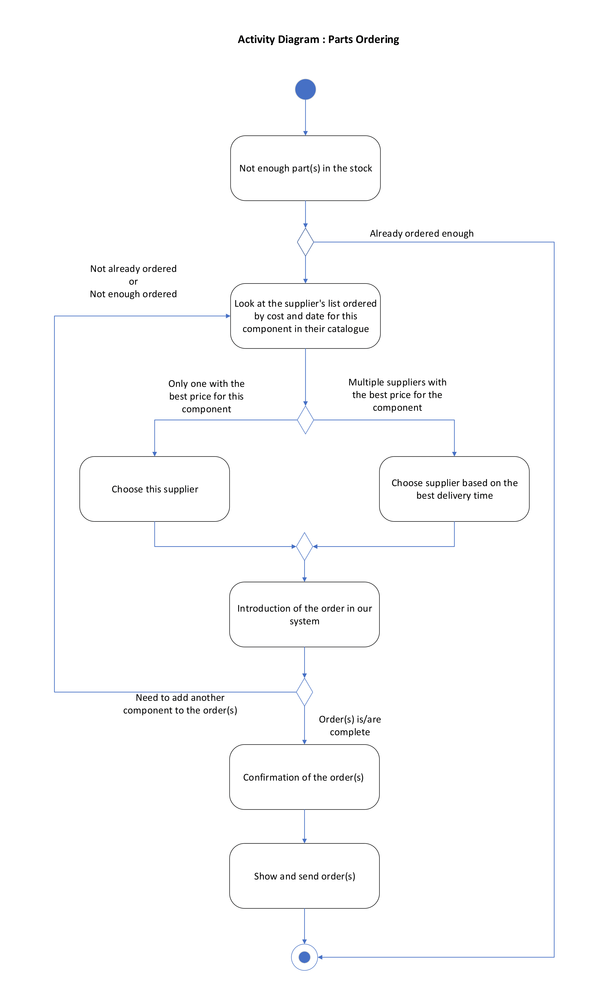
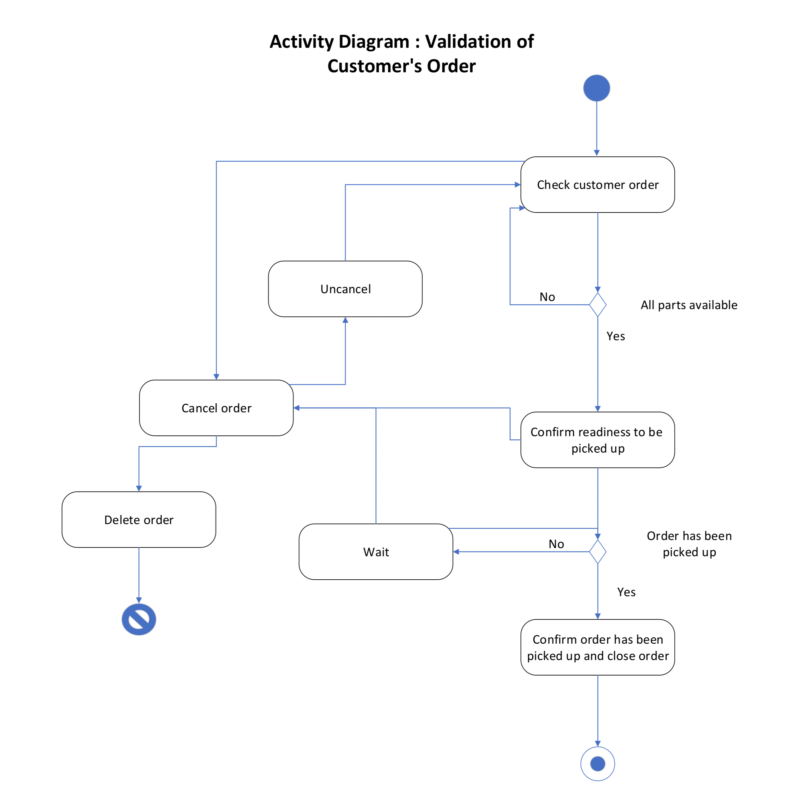
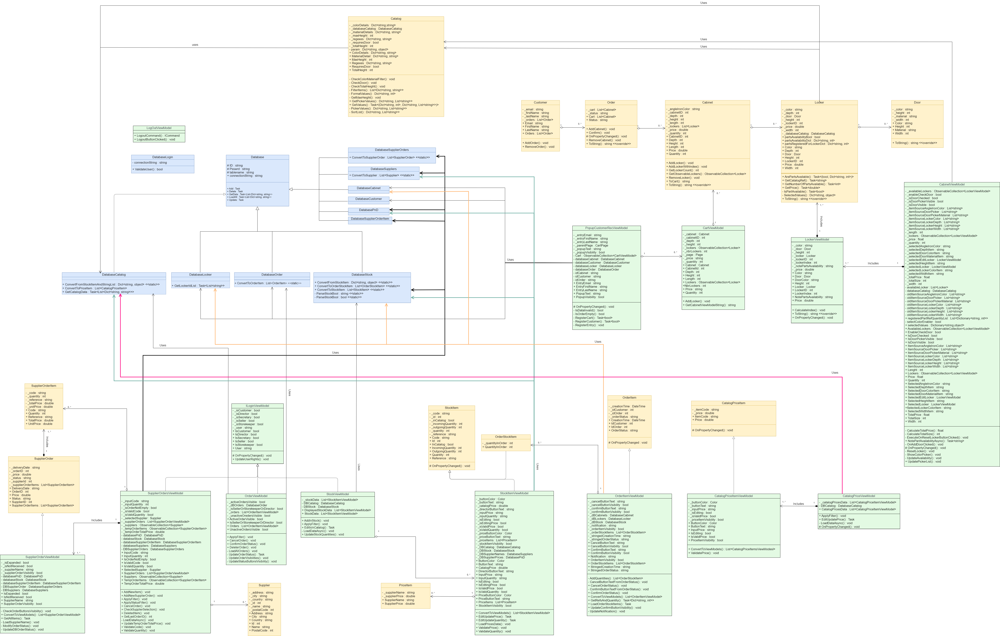

# KITBOX

## Description
Application designed to digitalize the cabinet selling process for the **Kitbox company**. The application streamlines the entire workflow, from encoding customer/supplier orders to optimizing stock management. The project is done using *C#* and *MAUI .NET 7* which can be used on any platform and all data is stored in a distant *MySQL* cloud database.

## 1. Features
- Locker composition
- Cabinet composition
- Manage cart
- Creating customer orders
- Viewing current customer orders
- Stock quantities management
- Adding new items to the catalog/stock
- Creating supplier orders
- Viewing all supplier orders
- User interfaces controlled by Log In

## 2. Installation
### Requirements
- *.NET SDK 7* or higher

### Setup
1. Clone the repository :
```
git clone https://github.com/sstav0/KITBOX.git
```
2. Build and Run the application in your editor

## 3. Diagrams
### Activity Diagram




### Use Case Diagram


### Class Diagram


### Relationship Entity Diagram


## 4. User Guide
[Explanations & UI]
